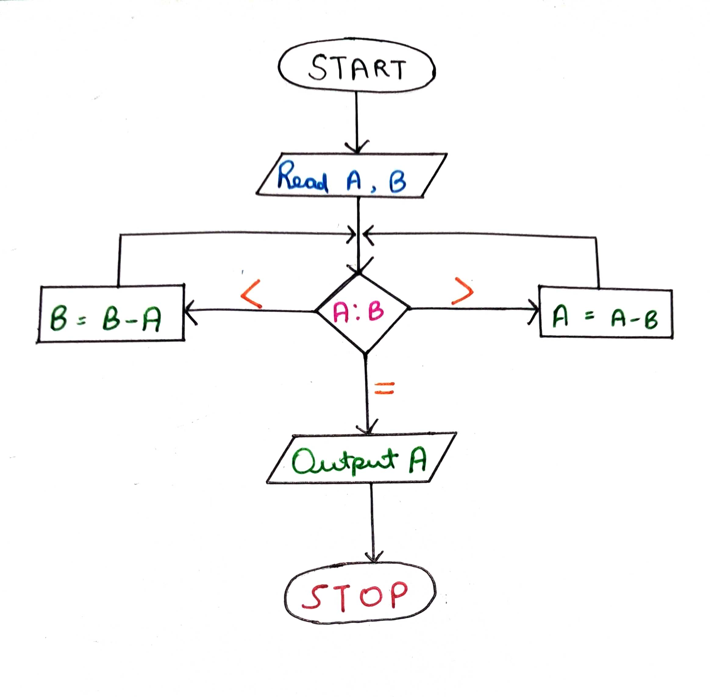
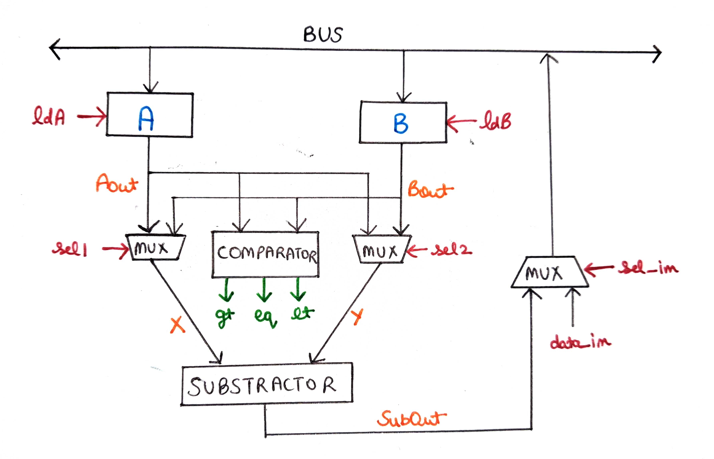
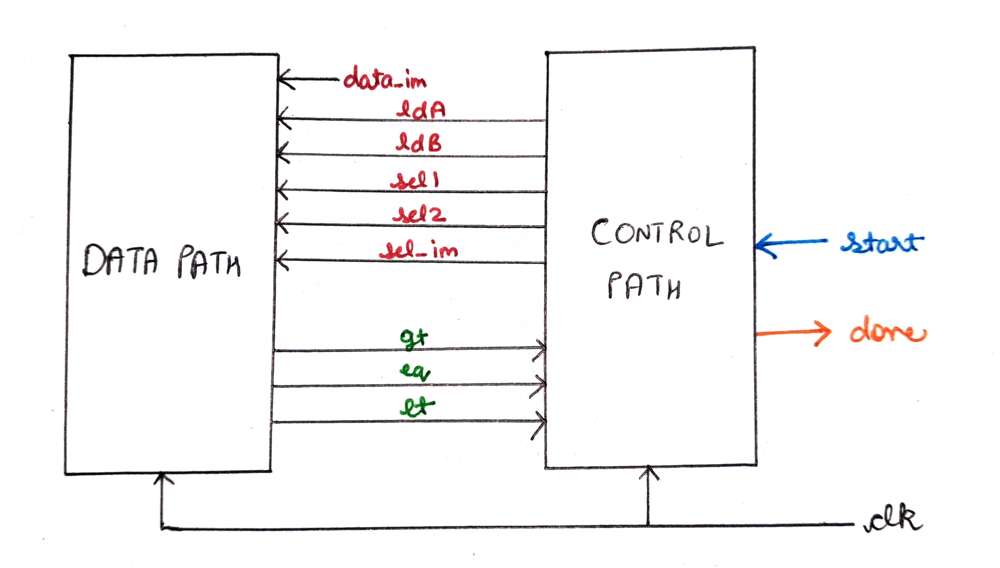
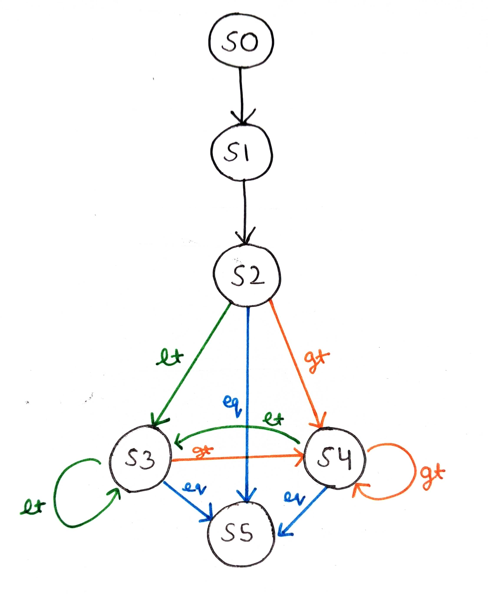
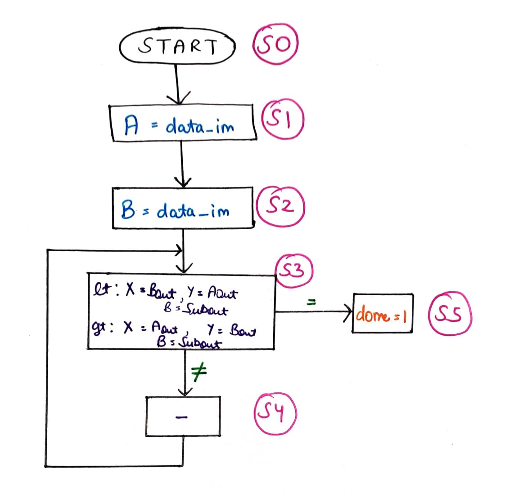
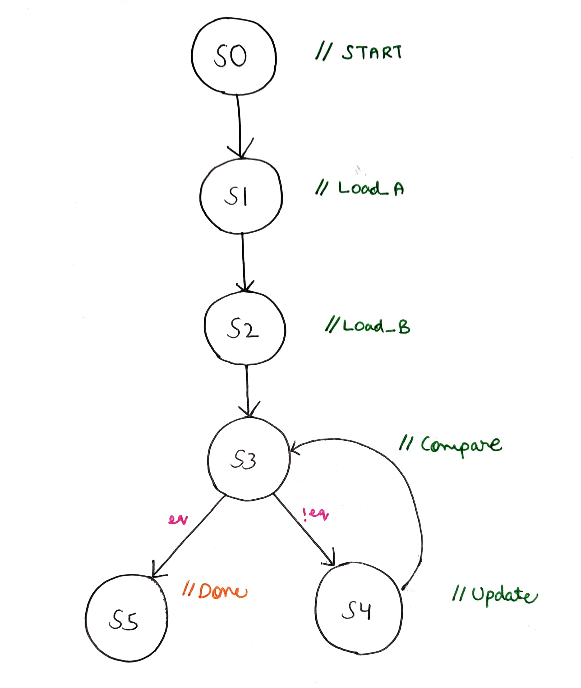

# HCF_GCD-Finder

In this program, we will be implementing a Highest Common Factor finder using a datapath and a controller.
# Algorithm used

# Datapath 

# Datapath and Control Path relationship

# Control Path 1
 

# Control Path 2
 

# RTL Design
